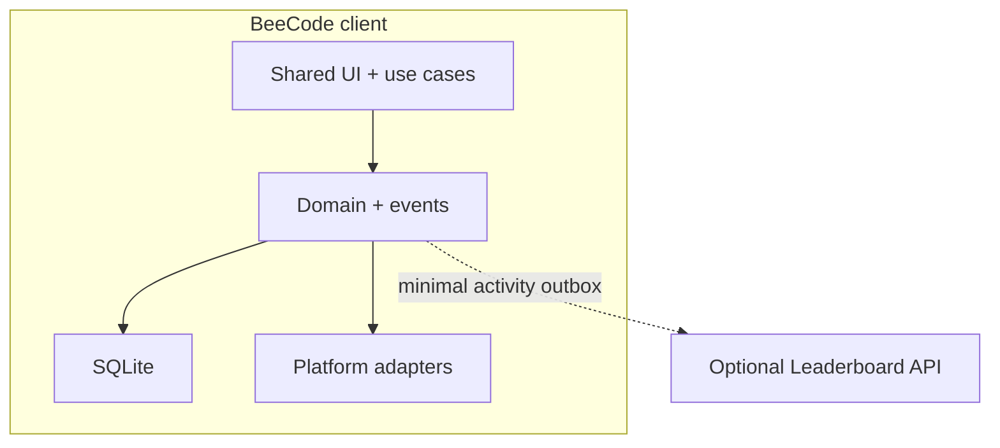
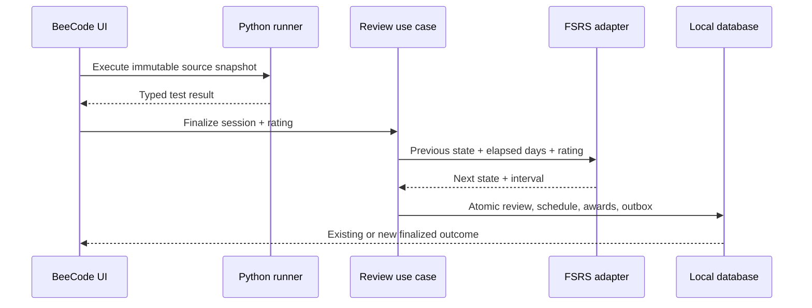

# BeeCode high-level architecture

## Architectural intent

BeeCode is one offline-first study product with two first-class clients.
Android and desktop share Problem semantics, review workflow, FSRS behavior,
achievement rules, persistence contracts, and the optional Leaderboard
protocol. Platform-specific adapters own Python execution, application
lifecycle, packaging, credentials, and any UI component that cannot meet the
shared behavior well.

The central boundary is:

> Local study is authoritative. Social state is an optional projection.

Opening Problems, editing source, running tests, finalizing reviews, scheduling
with FSRS, earning local achievements, inspecting history, and exporting data
must work without an account or network.

## System topology



Platform adapters include:

- FSRS mapping to the generic engine;
- desktop and Android Python runners;
- database drivers and secure credential storage;
- clocks, files, notifications, and networking.

The domain does not import Compose, Android, desktop, SQL, HTTP, Python-provider,
or server framework classes.

## Planned repository modules

```text
BeeCode/
├── androidApp/       Android entry point, lifecycle, credentials, Python adapter
├── desktopApp/       Desktop entry point, packaging, process runner
├── shared/           KMP shared UI and application services
├── domain/           Pure models, commands, events, and state machines
├── persistence/      Local schema, repositories, transactions, migrations
├── fsrs-core/        Generic dev.bee.fsrs engine from kanji_anki
├── fsrs-adapter/     BeeCode schedule policy and model mapping
├── python-api/       Platform-neutral execution contracts
├── protocol/         Versioned Leaderboard DTOs
├── server/           Ktor/PostgreSQL modular monolith
├── content/          Problem packs and achievement definitions
└── tools/            Problem generator/compiler/validator
```

The exact number of Gradle modules may be smaller in the first walking
skeleton. The dependency rules are more important than the physical split.

## Recommended client technology direction

- Compose Multiplatform for shared Android/desktop rendering and application
  logic.
- Separate Android application and desktop JVM entry modules.
- A shared KMP domain/application layer with platform adapter interfaces.
- SQLite as local authority, with SQLDelight as the leading shared schema/
  migration candidate.
- Generic Kotlin FSRS engine vendored or extracted from
  [`bee-san/kanji_anki`](https://github.com/bee-san/kanji_anki), pinned to source
  commit and wrapped by a BeeCode-owned scheduler adapter.
- Platform-neutral `PythonRunner`; out-of-process worker on desktop and an
  isolated Android service/process if the provider spike proves the boundary.
- Ktor/PostgreSQL/Docker Compose/Caddy for the optional self-hosted server.

The researched initial toolchain pins and AGP 9 module constraints are recorded
in [the architecture goals](../goals/01-architecture-foundations.md). They are a
compatibility set to validate in a walking skeleton, not implementation already
performed.

## Problem content architecture

A Problem is source-controlled content:

```text
content/packs/core/problems/two-sum/
├── problem.yaml
├── statement.md
├── starter.py
├── tests.yaml
├── reference.py
└── assets/
```

Tooling discovers folders automatically. Adding a Problem never requires a
central Kotlin registry.

Build-time tooling:

1. validates the versioned schema, paths, provenance, assets, limits, codecs,
   and comparator IDs;
2. compiles starter/reference Python;
3. runs the trusted reference against all declared tests;
4. generates one canonical runtime representation and index;
5. produces a deterministic `.beecodepack`;
6. proves `reference.py` and tooling-only files are absent.

Client packs contain data only. They select trusted built-in codecs/comparators
by versioned ID and cannot introduce arbitrary executable judge logic.

## Core domain entities

| Entity | Responsibility |
|---|---|
| `ProblemDefinition` | Immutable compiled Problem content and revision/hash. |
| `SolutionDraft` | Local source, starter base, edit revision, and reveal state. |
| `ExecutionRun` | Bounded local attempt and finite typed result. |
| `ReviewSession` | Explicit started/working/passed/revealed/finalized lifecycle. |
| `ReviewEvent` | Immutable scheduler input and audit record. |
| `ProblemSchedule` | Materialized FSRS state and next due decision. |
| `ProblemSolved` | Derived once from an eligible finalized session. |
| `AchievementAward` | Immutable, idempotent local accomplishment. |
| `SocialOutboxEvent` | Minimal eventually delivered activity metadata. |

Stable IDs include Problem/revision, execution run, review session, domain
event, achievement definition, account, device, and Leaderboard.

## Review transaction



The final database transaction:

1. checks the `reviewSessionId` has not finalized;
2. appends the immutable review event;
3. persists the FSRS transition/current schedule;
4. emits `ProblemSolved` when the suite passed without reveal;
5. updates achievement projections and appends awards;
6. inserts a minimal social event into the outbox;
7. marks the session finalized.

It commits all effects or none. A retry returns the existing result. A test run
alone never mutates FSRS, achievements, or Leaderboards.

## FSRS boundary

The generic `dev.bee.fsrs` engine owns memory mathematics:

- initial state;
- retrievability;
- next difficulty/stability;
- next interval;
- complete review calculation.

BeeCode owns:

- which ratings are allowed from pass/fail/reveal evidence;
- review-session idempotency;
- due-queue ordering and daily limits;
- parameter/version migration;
- persistence, clocks, explanation, and history.

Every schedule transition records engine/parameter versions. Golden vectors run
through both platform compositions before an upgrade can change schedules.

## Python execution boundary

Both platforms implement:

```text
RunRequest
- run and Problem revision IDs
- immutable source
- trusted entry point, codecs, comparators, and tests
- timeout/output/resource limits
- contract and harness versions

RunResult
- finite outcome kind
- bounded per-test results and diagnostics
- timing/truncation/resource flags
- runner and Python versions
```

Desktop direction:

- a disposable out-of-UI-process CPython worker;
- framed structured protocol without shell interpolation;
- fresh constrained temporary workspace;
- clean environment, deadline, output/resource caps, process-tree cleanup;
- OS-specific containment with a visible capability level.

Android direction:

- a pinned embedded runtime behind a bound worker service/process;
- no network permission or access to main-process credentials/storage;
- UI-enforced deadline and worker termination/recreation;
- `arm64-v8a` physical device and `x86_64` emulator evidence.

The Android spike is a go/no-go gate: if the provider cannot operate behind an
honest isolation boundary, evaluate a separate signature-bound runner APK or
change the declared capability. Do not call same-process execution a sandbox.

## Achievement architecture

Canonical events feed deterministic, versioned reducers. Definitions are data,
but evaluator kinds are trusted code. Progress is rebuildable; awards are
immutable/idempotent.

5am Club is normative:

- source: eligible finalized `ProblemSolved`;
- official suite passed; no solution/reference reveal;
- local window `[00:00, 06:00)`;
- seven distinct consecutive local dates;
- one qualifying contribution per date;
- active streak uses a locked IANA timezone policy;
- UTC instant, timezone, local date, and local time remain auditable;
- immediate local award; independent server confirmation for public title.

## Leaderboard architecture

Private custom Leaderboards are the complete v1 social model. The service owns
accounts, membership/invites, accepted social activity, aggregate ranks, and
server-confirmed awards.

The client uploads only idempotent activity metadata. Network delivery is
at-least-once; server unique constraints make social effects exactly once.

Rank periods use the board's timezone and week start. Rows show:

`rank · avatar · display name + equipped title · Problems solved · streak`

The server is a modular monolith:

```text
Caddy/TLS → Ktor API → PostgreSQL
```

It needs no Redis, broker, object store, WebSockets, or microservices in v1.

## Security and privacy boundary

The Leaderboard never receives:

- learner source or draft history;
- stdout/stderr or expected/actual values;
- detailed test/run transcript;
- FSRS state, rating, interval, due date, or parameters;
- local backup/database content.

Runner workers never receive:

- account/refresh tokens;
- Leaderboard URL/configuration;
- local database path;
- arbitrary host environment or solution history.

Backups may contain source, so export UI and optional encryption must treat them
as sensitive. Logs and support bundles are allowlisted/redacted and previewed.

## Highest-risk decision gates

1. Android Python provider works behind a killable isolation boundary.
2. Each supported desktop OS has an honestly testable containment level.
3. The editor is usable with Android IMEs and desktop keyboard/accessibility.
4. Local database transaction and migration behavior survives process failure.
5. Problem packs are deterministic and exclude reference source.
6. FSRS golden vectors agree across targets.
7. 5am Club passes timezone/DST/boundary/replay tests.
8. Duplicate offline social uploads count once and contain no sensitive fields.
9. Self-host deployment restores from backup on a clean environment.

The full acceptance criteria, dependencies, risks, tests, and one-year
sequencing are in [`goals/`](../goals/README.md).

