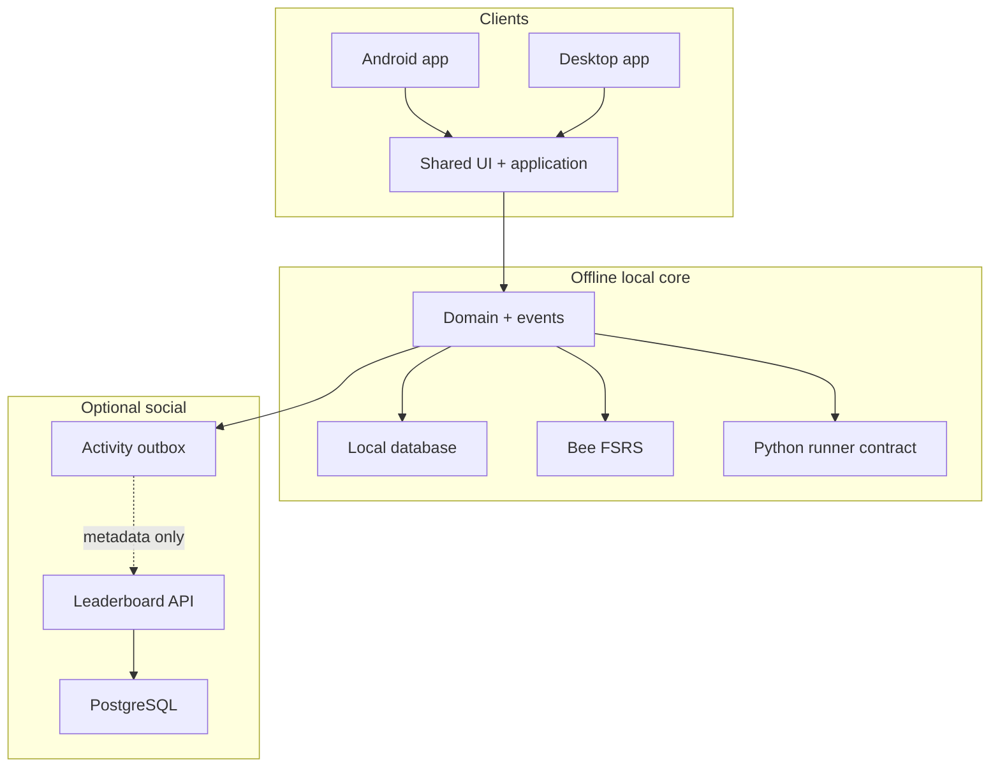

# Target 01: architecture foundations

This target creates stable boundaries so the desktop client, Android client,
Problem tooling, Python runtimes, scheduler, achievements, and optional server
can evolve without becoming one inseparable application.

## Planned system shape



The important boundary is not “frontend versus backend”. It is **local study
truth versus optional social projection**. The local domain remains complete
when the server does not exist.

## Planned module topology

```text
BeeCode/
├── androidApp/       Android entry point and Python runtime adapter
├── desktopApp/       Desktop entry point and process runner
├── shared/           KMP UI, application services, and domain presentation
├── domain/           Platform-neutral entities, events, and use cases
├── persistence/      Database schema, repositories, and migrations
├── fsrs-core/        Generic engine from bee-san/kanji_anki
├── fsrs-adapter/     BeeCode review policy around the generic engine
├── python-api/       Execution contracts, test results, and limits
├── protocol/         Versioned Leaderboard DTOs
├── server/           Ktor/PostgreSQL Leaderboard service
├── content/          Problem packs and achievement definitions
├── tools/            Problem compiler, validator, and generators
└── goals/            Product plan and evidence gates
```

This is a target architecture. Early milestones may combine modules while
interfaces settle, but dependencies must point toward the domain and never from
the domain into UI, Android, desktop, database, or server frameworks.

## Recommended bootstrap stack

These are planning pins researched against the live Kotlin Multiplatform wizard
on 2026-07-28. They should be validated together in ARCH-002 before adoption;
later upgrades should change one axis at a time.

| Component | Initial pin | Planning reason |
|---|---:|---|
| Gradle wrapper | 9.1.0 | Current wizard baseline and AGP 9.0.1 requirement. |
| Kotlin / KGP | 2.4.10 | Current stable compatibility lane. |
| Compose Multiplatform | 1.11.1 | Current stable Android/desktop UI baseline. |
| Compose compiler | 2.4.10 | Must match Kotlin. |
| Android Gradle Plugin | 9.0.1 | Current wizard baseline without taking a newer upgrade lane. |
| Gradle runtime | JDK 21 LTS | Current wizard daemon baseline; target JVM bytecode separately. |
| Android compile/target | API 36 | Current wizard baseline. |
| Android minimum | API 24 | Compatible with the planned Android Python provider. |
| Android Python spike | Chaquopy 17.0.0 | Supports the planned AGP range and Python 3.10–3.14. |

AGP 9 imposes an important shape: the Android application entry point remains a
standalone `com.android.application` module, while shared Android/JVM code uses
the Android-KMP library plugin. Chaquopy belongs only in the application module
behind `PythonRunner`; it must never become a domain dependency.

Primary planning sources:

- [Kotlin Multiplatform wizard](https://kmp.jetbrains.com/)
- [Recommended KMP project structure](https://kotlinlang.org/docs/multiplatform/multiplatform-project-recommended-structure.html)
- [KMP compatibility guide](https://kotlinlang.org/docs/multiplatform/multiplatform-compatibility-guide.html)
- [Compose compatibility](https://kotlinlang.org/docs/multiplatform/compose-compatibility-and-versioning.html)
- [AGP 9 release notes](https://developer.android.com/build/releases/agp-9-0-0-release-notes)
- [Android built-in Kotlin migration](https://developer.android.com/build/migrate-to-built-in-kotlin)
- [Android-KMP library plugin](https://developer.android.com/kotlin/multiplatform/plugin)
- [Chaquopy Android setup](https://chaquo.com/chaquopy/doc/current/android.html)

## ARCH-001 — Ratify dependency boundaries

- **State:** proposed
- **Outcome:** module ownership and allowed dependency direction are explicit.
- **Deliverables:** module map, responsibility table, dependency rules, and
  exception process.
- **Acceptance:**
  - The domain imports no Compose, Android, desktop, SQL, HTTP, or Python
    provider classes.
  - Android and desktop implement the same runner contract.
  - BeeCode review policy does not modify the generic FSRS equations.
  - Server modules cannot access local source drafts or schedule repositories.
  - Architecture tests fail on forbidden edges.
- **Evidence:** dependency graph and automated module-boundary checks.
- **Dependencies:** PROD-002, PROD-006.
- **Risks:** premature module explosion; “shared” becoming an unowned dumping
  ground.
- **Non-goals:** an interface for every class.

## ARCH-002 — Validate the toolchain as one compatibility set

- **State:** proposed
- **Outcome:** one pinned stack builds both application entry points before
  product complexity is added.
- **Deliverables:** version catalog, wrapper checksum, toolchain requirements,
  upgrade notes, and minimal smoke applications.
- **Acceptance:**
  - Clean cached and uncached builds pass.
  - Android debug assembly, desktop compilation, shared tests, and packaging
    configuration resolve from one revision.
  - JDK, Android SDK, Python runtime, and host requirements fail with actionable
    diagnostics.
  - Version pins and their rationale are recorded.
- **Evidence:** clean-machine CI and a second-developer setup exercise.
- **Dependencies:** ARCH-001.
- **Risks:** adopting individually current versions that are not compatible as
  a set.
- **Non-goals:** automatic dependency upgrades in the first milestone.

## ARCH-003 — Define shared domain ports

- **State:** proposed
- **Outcome:** use cases depend on behavior contracts rather than platform
  frameworks.
- **Deliverables:** contracts for `ProblemRepository`, `PythonRunner`,
  `Scheduler`, `ReviewRepository`, `AchievementEngine`, `ActivityOutbox`,
  `Clock`, and `TransactionRunner`.
- **Acceptance:**
  - In-memory fakes can execute the whole review workflow.
  - Each platform adapter passes the same contract suite.
  - Ports return typed outcomes rather than framework exceptions.
  - Cancellation and transaction semantics are stated.
- **Evidence:** contract-test matrix.
- **Dependencies:** ARCH-001.
- **Risks:** leaky abstractions hiding materially different runtime behavior.
- **Non-goals:** forcing server and client persistence behind one repository.

## ARCH-004 — Create canonical identity and time types

- **State:** proposed
- **Outcome:** IDs, revisions, clocks, and study dates cannot be casually mixed.
- **Deliverables:** typed IDs for Problems, packs, runs, review sessions, events,
  users, and Leaderboards; UTC instant, IANA timezone, and local study-date
  value types.
- **Acceptance:**
  - IDs validate at creation and serialize canonically.
  - A Problem ID is stable across content revisions.
  - Wall-clock time is never stored without its UTC instant and timezone when
    achievement or ranking semantics depend on it.
  - Sorting and equality rules are deterministic.
- **Evidence:** serialization, invalid-input, DST, and property tests.
- **Dependencies:** PROD-002.
- **Risks:** stringly typed IDs; conflating due date with completion instant.
- **Non-goals:** globally sortable identifiers where random opaque IDs suffice.

## ARCH-005 — Adopt command/event state transitions

- **State:** proposed
- **Outcome:** critical behavior is represented by explicit commands and
  append-only events.
- **Deliverables:** command catalog, event catalog, invariants, correlation IDs,
  causation IDs, and schema-version policy.
- **Acceptance:**
  - `FinalizeReview` can create at most one `ReviewFinalized` per
    `reviewSessionId`.
  - Scheduling, achievement projection, and social outbox derive from the same
    canonical transition.
  - Replaying canonical events rebuilds derived state.
  - Failed or cancelled runs do not emit finalized-review events.
- **Evidence:** state-machine and replay tests.
- **Dependencies:** ARCH-003, ARCH-004.
- **Risks:** adopting heavy event-sourcing ceremony for noncritical settings.
- **Non-goals:** treating every UI interaction as a domain event.

## ARCH-006 — Separate runtime and wire representations

- **State:** proposed
- **Outcome:** persisted and network formats can evolve without infecting
  domain models.
- **Deliverables:** mapping layer, version fields, unknown-field policy,
  compatibility window, and migration fixtures.
- **Acceptance:**
  - Domain models contain no serialization annotations unless an ADR justifies
    them.
  - Old supported database/API/pack fixtures decode predictably.
  - Unknown enum values produce explicit compatibility errors.
  - Network DTOs contain only social-safe fields.
- **Evidence:** compatibility suite and schema diff review.
- **Dependencies:** ARCH-003.
- **Risks:** duplicated mapping code; accidental sensitive field exposure.
- **Non-goals:** one universal schema for database, backup, packs, and HTTP.

## ARCH-007 — Define configuration and secret boundaries

- **State:** proposed
- **Outcome:** development, test, release, and self-hosted environments are
  reproducible without embedding secrets.
- **Deliverables:** configuration schema, environment strategy, safe defaults,
  validation, example files, and secret inventory.
- **Acceptance:**
  - Production server startup rejects default secrets and unsafe public
    configuration.
  - Client endpoints and feature flags are environment-specific and visible.
  - No signing key, token, password, or production URL is committed.
  - Diagnostics redact secret values.
- **Evidence:** secret scan and invalid-configuration tests.
- **Dependencies:** SEC-006.
- **Risks:** convenient development defaults reaching production.
- **Non-goals:** a generic secrets-management product.

## ARCH-008 — Establish architecture decisions

- **State:** proposed
- **Outcome:** choices expensive to reverse are recorded with evidence and a
  revisit condition.
- **Deliverables:** ADRs for module shape, persistence, Problem packs, Python
  runtimes, FSRS provenance, event model, Leaderboard boundaries, and editor
  choice.
- **Acceptance:**
  - Every ADR states context, decision, consequences, rejected alternatives,
    and revisit trigger.
  - Spikes link measurements or compatibility evidence.
  - Superseded decisions remain discoverable.
- **Evidence:** ADR review at each phase gate.
- **Dependencies:** PROD-010.
- **Risks:** decisions becoming stale documentation.
- **Non-goals:** ADRs for trivial reversible implementation details.

## ARCH-009 — Build one-command developer workflows

- **State:** proposed
- **Outcome:** contributors can validate prerequisites and run focused checks
  without private setup knowledge.
- **Deliverables:** bootstrap diagnostic, desktop run, Android build/test,
  Problem validation, server dev stack, and full verification commands.
- **Acceptance:**
  - Scripts do not silently install or mutate global toolchains.
  - Missing SDK/emulator/KVM/runtime conditions are named precisely.
  - Fast checks and exhaustive release checks are separate.
  - CI invokes the same underlying tasks as developers.
- **Evidence:** clean-machine walkthrough.
- **Dependencies:** ARCH-002.
- **Risks:** scripts masking standard tool behavior or becoming OS-specific.
- **Non-goals:** supporting undocumented host systems.

## ARCH-010 — Maintain dependency provenance

- **State:** proposed
- **Outcome:** every external component has an owner, version, license, and
  update policy.
- **Deliverables:** dependency inventory, SBOM, license report, exception list,
  and high-risk component watchlist.
- **Acceptance:**
  - FSRS source provenance is pinned to a commit and attributed.
  - Python provider, editor, database, server, and crypto dependencies have
    explicit upgrade owners.
  - Release evidence archives the dependency graph.
  - Critical advisories have a response SLA.
- **Evidence:** automated report plus human review.
- **Dependencies:** ARCH-002, SEC-002.
- **Risks:** broad cross-platform dependency surface.
- **Non-goals:** banning dependencies merely to minimize their count.

## Architecture exit gate

This target is verified only when a clean environment can build the documented
shells and contract-test fakes, dependency rules are enforced, the critical
ADRs are accepted, and no study behavior requires the optional server.

