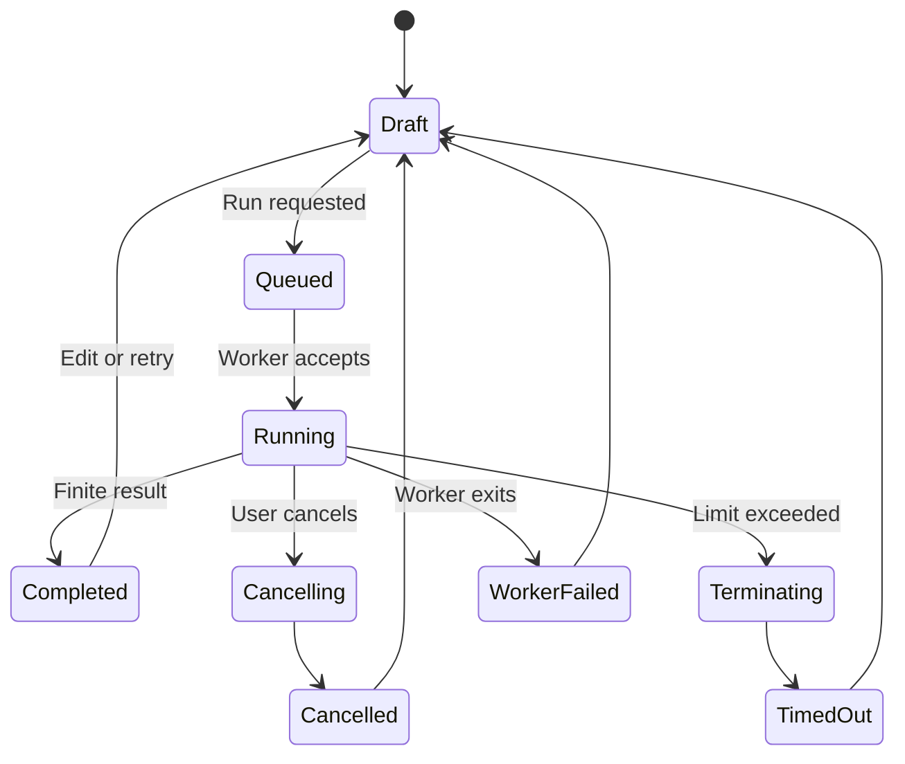

# Target 03: Python execution

This target defines how BeeCode runs learner-written Python locally on desktop
and Android, reports deterministic test results, survives broken programs, and
communicates its security limits honestly.

## Trust statement

BeeCode v1 executes code written by the device owner against trusted BeeCode
harnesses and Problem data. It is **not** a hardened hostile-code sandbox.

- Learner source never runs on the Leaderboard server.
- `reference.py` never runs in a released client.
- Community packs cannot provide executable judges, codecs, or comparators.
- Desktop and Android may enforce different low-level restrictions, but both
  implement one visible execution contract.
- Any claimed filesystem, network, process, memory, or import restriction must
  have a corresponding test.

## Execution lifecycle

No terminal run state alone finalizes a review. A separate review command uses
the run evidence.

## Canonical result taxonomy

| Result | Meaning |
|---|---|
| `Passed` | Every required test produced an accepted result. |
| `WrongAnswer` | Execution completed, but at least one comparator rejected output. |
| `SyntaxError` | Source could not be compiled; location is available where possible. |
| `RuntimeError` | Learner code raised an exception. |
| `ContractError` | Expected entry point or output shape was absent/invalid. |
| `TimedOut` | Per-test or whole-run time budget was exceeded. |
| `ResourceExceeded` | A declared output/memory/depth/process limit was exceeded. |
| `Cancelled` | Learner requested cancellation before a final result. |
| `WorkerFailed` | Platform worker stopped or protocol integrity failed. |
| `Unsupported` | Runtime/ABI/Problem contract combination cannot execute. |

Internal failures must not masquerade as learner wrong answers.

## RUN-001 — Version the platform-neutral execution contract

- **State:** proposed
- **Outcome:** both platforms receive the same finite request and produce the
  same semantic result types.
- **Deliverables:** request/result models, version field, run ID, limits,
  cancellation semantics, serialization, and compatibility policy.
- **Acceptance:**
  - Request identifies Problem ID/revision, source hash, entry point, codecs,
    tests, limits, runtime, and harness version.
  - Result identifies run ID, test outcomes, diagnostics, durations, truncation,
    and worker/runtime versions.
  - There is no untyped “unknown error” success path.
  - Unsupported contract versions fail before executing source.
- **Evidence:** shared round-trip and compatibility tests.
- **Dependencies:** ARCH-003, PROB-002, PROB-003.
- **Risks:** platform details leaking into shared UI.
- **Non-goals:** wire compatibility with arbitrary online judges.

## RUN-002 — Design the desktop worker boundary

- **State:** proposed
- **Outcome:** learner code runs outside the UI process in a disposable,
  controllable worker.
- **Deliverables:** process topology, worker launcher, temporary workspace,
  protocol framing, environment allowlist, lifecycle state, and cleanup policy.
- **Acceptance:**
  - A worker crash cannot terminate the desktop UI.
  - Requests use length-framed structured messages, not ambiguous line parsing.
  - Source and test values are delivered without shell interpolation.
  - Working directories are unique and cleaned after bounded retention.
  - Parent exit and stale-worker cleanup are defined.
- **Evidence:** process crash, protocol corruption, special-character source,
  and orphan tests.
- **Dependencies:** RUN-001.
- **Risks:** command injection; platform-specific process-tree cleanup.
- **Non-goals:** reusing a learner's project virtual environment in v1.

## RUN-003 — Spike the Android Python boundary

- **State:** proposed
- **Outcome:** the selected embedded Python provider can be controlled strongly
  enough for BeeCode's declared behavior.
- **Deliverables:** isolated service/process prototype, ABI matrix, runtime size,
  startup measurements, termination experiment, module inventory, and ADR.
- **Acceptance:**
  - CPU-bound infinite code can be stopped without killing the app UI.
  - Process death preserves durable source and cannot finalize a review.
  - Supported `arm64-v8a` and emulator `x86_64` ABIs are demonstrated.
  - Runtime and package size are measured.
  - If the provider cannot meet termination/recovery requirements, the ADR
    rejects it and evaluates another architecture.
- **Evidence:** emulator and physical-device spike report.
- **Dependencies:** ARCH-002, RUN-001, AND-001.
- **Risks:** an in-process interpreter cannot be interrupted safely; Android
  process isolation and provider APIs may not align.
- **Non-goals:** declaring Chaquopy final before the spike.

## RUN-004 — Implement the deterministic judge contract

- **State:** proposed
- **Outcome:** trusted harness logic invokes the declared entry point, applies
  codecs/comparators, and reports every test consistently.
- **Deliverables:** harness specification, invocation rules, per-test isolation,
  result construction, and conformance fixtures.
- **Acceptance:**
  - Input values are decoded by trusted codec ID.
  - Missing or incorrectly shaped entry points become `ContractError`.
  - Expected and actual values are compared by trusted comparator ID/version.
  - Test order and stop/continue policy are explicit.
  - Global state cannot contaminate later tests beyond the documented isolation
    model.
- **Evidence:** identical semantic outcomes on desktop and Android fixtures.
- **Dependencies:** PROB-002, PROB-003, RUN-001.
- **Risks:** hidden platform coercions; global interpreter contamination.
- **Non-goals:** arbitrary custom judge scripts.

## RUN-005 — Enforce timeout and cancellation

- **State:** proposed
- **Outcome:** loops and expensive programs do not freeze BeeCode.
- **Deliverables:** per-test budget, whole-run budget, cancellation signal,
  grace period, hard termination, and UI state.
- **Acceptance:**
  - Infinite loop finishes as `TimedOut` within budget plus bounded grace.
  - Cancellation never appears as failure or successful review evidence.
  - Hard termination kills worker descendants where supported.
  - A new run starts successfully after timeout/cancellation.
  - Timeout values are visible in Problem/runtime diagnostics.
- **Evidence:** loops, deep recursion, sleeping, child-process, repeated-cancel,
  and race tests.
- **Dependencies:** RUN-002, RUN-003.
- **Risks:** orphaned descendants; platform APIs allowing only cooperative
  interruption.
- **Non-goals:** exact CPU-time accounting on every OS.

## RUN-006 — Bound output and diagnostic values

- **State:** proposed
- **Outcome:** huge stdout, exceptions, or structures cannot exhaust memory or
  make the results UI unusable.
- **Deliverables:** byte, line, depth, element, and rendering limits; truncation
  markers; safe trace cleanup.
- **Acceptance:**
  - Stdout/stderr are captured separately and capped.
  - Expected/actual summaries are structurally truncated without becoming
    misleading.
  - Internal temporary paths and secrets are removed from user diagnostics.
  - Unicode and invalid byte sequences have deterministic handling.
  - Truncation metadata is retained.
- **Evidence:** output flood, recursive value, huge exception, Unicode, and
  binary-output fixtures.
- **Dependencies:** RUN-004.
- **Risks:** truncation hiding the useful difference.
- **Non-goals:** preserving unlimited full logs.

## RUN-007 — Make diagnostics useful to learners

- **State:** proposed
- **Outcome:** failures explain what happened and point back to relevant source
  without pretending to be a full debugger.
- **Deliverables:** syntax locations, sanitized tracebacks, failing-test labels,
  expected/actual diff, timing, runtime status, and recovery actions.
- **Acceptance:**
  - Syntax errors can focus the editor line/column when available.
  - Learner frames are distinguished from harness frames.
  - Wrong-answer display respects Problem spoiler policy.
  - Worker failures suggest retry/runtime diagnostics rather than blaming code.
  - Every result is understandable by screen reader and without color.
- **Evidence:** golden result copy and usability sessions.
- **Dependencies:** RUN-006, UX-004.
- **Risks:** leaking hidden/build-time tests or overwhelming phone screens.
- **Non-goals:** interactive debugging.

## RUN-008 — Persist source and run snapshots safely

- **State:** proposed
- **Outcome:** editing/running/crashing cannot lose valuable source.
- **Deliverables:** debounce autosave, durable draft version, run snapshot hash,
  reset-to-starter confirmation, history retention, and recovery state.
- **Acceptance:**
  - A run executes an immutable source snapshot.
  - Continued typing cannot change the recorded run result.
  - Forced app/worker process death restores the last durable edit.
  - Reset never silently deletes the current source.
  - Source history pruning is bounded and documented.
- **Evidence:** concurrent edit/run and process-kill scenarios.
- **Dependencies:** DATA-002.
- **Risks:** storing large numbers of full source copies.
- **Non-goals:** Git-like branching/version control.

## RUN-009 — Record runtime reproducibility

- **State:** proposed
- **Outcome:** results can be explained after Python, harness, or pack upgrades.
- **Deliverables:** Python version, provider/build, ABI, harness version,
  contract version, Problem revision, comparator/codec versions, and limits in
  run metadata.
- **Acceptance:**
  - A diagnostic export can identify the exact execution environment.
  - Unsupported historical combinations remain viewable.
  - Runtime upgrades run the conformance suite before promotion.
  - A changed result across runtime versions is reported as compatibility
    evidence rather than silently rewritten history.
- **Evidence:** old-run fixture rendering and upgrade matrix.
- **Dependencies:** RUN-001, PROB-009.
- **Risks:** metadata volume; false reproducibility claims.
- **Non-goals:** retaining every old embedded runtime forever.

## RUN-010 — Specify capability restrictions per platform

- **State:** proposed
- **Outcome:** users and maintainers know exactly what code can access.
- **Deliverables:** capability matrix for filesystem, network, imports,
  processes, environment, clocks, randomness, threads, native modules, and
  memory.
- **Acceptance:**
  - Every restriction is marked enforced, best-effort, unavailable, or allowed.
  - Tests validate enforced restrictions on each supported platform.
  - UI/security documentation avoids the unqualified word “sandbox”.
  - Community code trust assumptions are explicit.
- **Evidence:** threat-model test report.
- **Dependencies:** SEC-003, RUN-002, RUN-003.
- **Risks:** protection varying by OS/API level.
- **Non-goals:** claiming containment against a fully malicious device owner.

## RUN-011 — Set performance and reuse policy

- **State:** proposed
- **Outcome:** execution feels responsive without reusing contaminated state.
- **Deliverables:** cold/warm benchmarks, worker pooling experiment, isolation
  proof, startup UI, and baseline budgets.
- **Acceptance:**
  - Hardware/runtime context accompanies measurements.
  - Worker reuse is adopted only if tests prove module/global/stdout isolation.
  - Cancellation remains responsive under load.
  - UI never blocks its main thread waiting for execution.
- **Evidence:** benchmark report and state-contamination suite.
- **Dependencies:** QLT-004, RUN-004.
- **Risks:** performance optimization weakening isolation.
- **Non-goals:** optimizing unrealistic microbenchmarks.

## RUN-012 — Recover from every worker failure stage

- **State:** proposed
- **Outcome:** launch, handshake, decode, execution, response, and cleanup
  failures return BeeCode to a usable state.
- **Deliverables:** fault-injection points, retry policy, worker health,
  correlation IDs, cleanup, and user-facing states.
- **Acceptance:**
  - A retry cannot reuse the same run ID as a completed attempt.
  - Protocol errors do not execute a partially decoded request.
  - Source remains durable throughout.
  - No worker failure emits a review-finalized event.
  - Repeated failures surface diagnostics instead of looping forever.
- **Evidence:** injected fault at every protocol boundary.
- **Dependencies:** RUN-002, RUN-003, DATA-002.
- **Risks:** rare race conditions around cancellation and result delivery.
- **Non-goals:** transparent infinite retry.

## Python-execution exit gate

The target is verified only when one shared conformance suite yields equivalent
semantic outcomes on desktop and Android for pass, wrong answer, syntax error,
runtime error, contract error, timeout, cancellation, resource excess, and
worker failure—and a learner can always recover their source.

