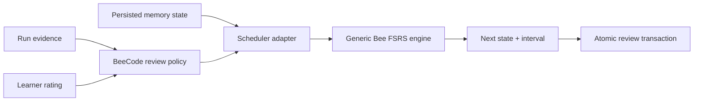
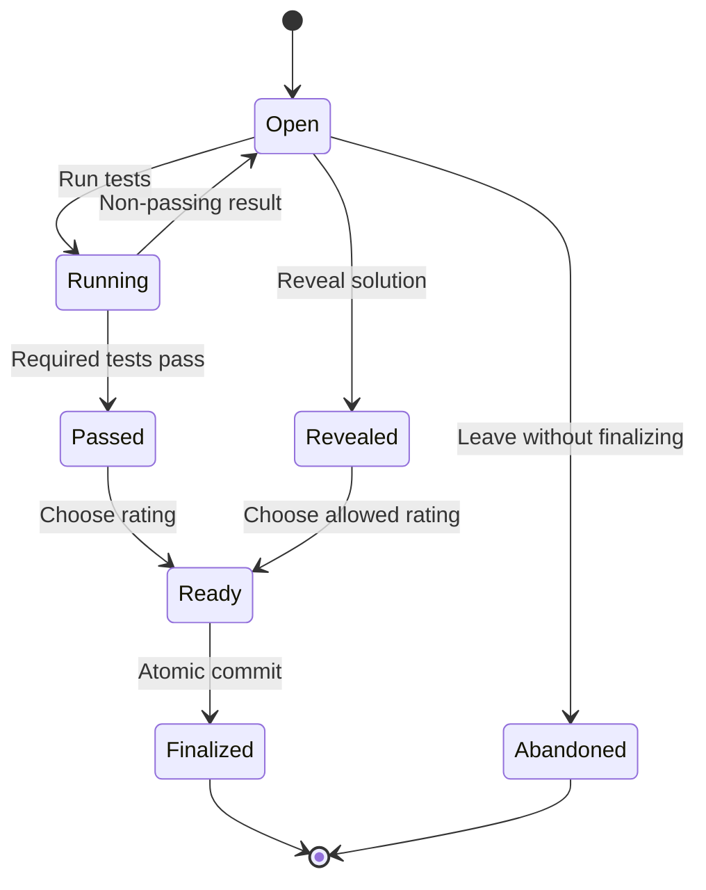

# Target 04: reviews and FSRS

This target turns a Problem attempt into durable study history and a future due
date using the generic FSRS engine from the user's
[`bee-san/kanji_anki`](https://github.com/bee-san/kanji_anki) repository.

The engine performs memory math. BeeCode owns the workflow policy around it.
Those concerns must remain separate.

## Engine integration boundary

The generic engine API already provides initial state, retrievability, next
state, next interval, and complete review calculation. BeeCode should copy or
extract only the generic `dev.bee.fsrs` module—not Kani-specific promotion or
ladder rules.

## Review-session state model

Actual rating availability is a product policy. The state model must guarantee
that impossible combinations are rejected, not merely hidden by the UI.

## SRS-001 — Vendor or extract the generic Bee FSRS module

- **State:** proposed
- **Outcome:** BeeCode uses the user's engine unchanged and can prove its source
  provenance.
- **Deliverables:** pinned source commit, generic source module, attribution,
  license/permission record, source-diff process, and compatibility fixtures.
- **Acceptance:**
  - Imported code is limited to generic `dev.bee.fsrs` memory math.
  - No Android, UI, database, Kani ladder, deck, or promotion policy enters the
    module.
  - Local changes are either absent or documented line by line.
  - Upstream behavior tests pass unchanged where available.
- **Evidence:** source manifest, diff report, and tests.
- **Dependencies:** ARCH-010.
- **Risks:** repository has no explicit license file; permission/provenance
  needs recording even though the owner authorized reuse.
- **Non-goals:** copying unrelated Kani application code.

## SRS-002 — Define the BeeCode scheduler port

- **State:** proposed
- **Outcome:** the application depends on a small stable scheduling contract.
- **Deliverables:** scheduler input/output, memory-state mapping, parameter
  policy, clock inputs, and fake implementation.
- **Acceptance:**
  - UI and persistence do not call `FsrsEngine` directly.
  - Adapter validates elapsed days, retention, maximum interval, and state.
  - Input/output preserve sufficient algorithm/version audit data.
  - Shared workflow tests run against a fake scheduler.
- **Evidence:** contract suite.
- **Dependencies:** ARCH-003, SRS-001.
- **Risks:** adapter silently adding policy to equations.
- **Non-goals:** abstracting FSRS so broadly that its concepts disappear.

## SRS-003 — Define rating policy from run evidence

- **State:** proposed
- **Outcome:** learner judgment remains explicit while impossible “clean solve”
  states are prevented.
- **Deliverables:** rating matrix for pass/fail/reveal/abandon, guidance copy,
  override policy, and domain validation.
- **Acceptance:**
  - A passing run does not silently choose a rating.
  - Failed required tests cannot be finalized as an unaided success.
  - Revealed-solution sessions have a named restricted outcome.
  - Manual override behavior and consequences are recorded.
  - The domain rejects ratings the UI should never send.
- **Evidence:** table-driven state tests and usability review.
- **Dependencies:** PROD-007, RUN-004.
- **Risks:** overly punitive policy encourages dishonest workarounds.
- **Non-goals:** using test runtime as a proxy for recall difficulty.

## SRS-004 — Version persisted memory state

- **State:** proposed
- **Outcome:** schedule truth survives upgrades and can be audited.
- **Deliverables:** schema for stability, difficulty, elapsed days, interval,
  due date/instant, last review, lapses, review count, desired retention,
  maximum interval, parameter set/version, and algorithm version.
- **Acceptance:**
  - Numeric bounds and null/new-Problem state are explicit.
  - Current state can be rebuilt from review history.
  - Parameter and algorithm versions are attached to every transition.
  - Serialization round trips without precision surprises.
- **Evidence:** database and backup fixtures.
- **Dependencies:** SRS-002, DATA-001.
- **Risks:** storing derived values inconsistently.
- **Non-goals:** hiding all FSRS state from diagnostic exports.

## SRS-005 — Build deterministic due queues

- **State:** proposed
- **Outcome:** new, learning, due, overdue, suspended, and buried Problems appear
  in a predictable order.
- **Deliverables:** queue categories, ordering, daily limits, new/review mix,
  sibling rules if any, manual study, and empty-state behavior.
- **Acceptance:**
  - Queue computation uses an injected clock and profile timezone.
  - Ordering has a deterministic tie-breaker.
  - Suspended/retired/incompatible Problems never appear as normal due items.
  - Limits do not make already-started reviews disappear.
  - Manual study cannot silently change due state without finalization.
- **Evidence:** clock-controlled queue suite on large seeded catalog.
- **Dependencies:** SRS-004.
- **Risks:** excessive policy copied from generic flashcard apps.
- **Non-goals:** recreating Anki deck-option complexity in v1.

## SRS-006 — Make finalization exactly once

- **State:** proposed
- **Outcome:** one `reviewSessionId` creates at most one durable review and
  downstream event set.
- **Deliverables:** idempotency constraint, atomic transaction, retry response,
  concurrency control, and recovery behavior.
- **Acceptance:**
  - Double tap, process restart, database retry, and outbox retry cannot create
    a second review.
  - Review history, current memory state, achievement event, and social outbox
    row commit atomically.
  - If commit outcome is uncertain, retry returns the existing final result.
  - A finalized review is immutable; correction is a separate auditable event.
- **Evidence:** concurrency and fault-injection integration tests.
- **Dependencies:** ARCH-005, DATA-002.
- **Risks:** crash between schedule and events producing split truth.
- **Non-goals:** making every transient test run idempotent across devices.

## SRS-007 — Fix study-day and elapsed-time semantics

- **State:** proposed
- **Outcome:** schedules, achievements, history, and rankings agree across
  midnight, DST, and travel.
- **Deliverables:** UTC/local/timezone storage rule, elapsed-day calculation,
  profile timezone policy, clock anomaly behavior, and test matrix.
- **Acceptance:**
  - UTC instant, IANA timezone ID, and derived local date are stored for every
    finalized review.
  - The definition of “elapsed days” passed to FSRS is explicit.
  - Timezone changes never rewrite historical local dates.
  - Backward/future clock anomalies are visible and bounded.
- **Evidence:** DST gaps/overlaps, midnight, travel, leap day, and clock rollback
  tests.
- **Dependencies:** ARCH-004.
- **Risks:** mixing device timezone with profile/Leaderboard timezone.
- **Non-goals:** preventing a device owner from changing their clock.

## SRS-008 — Freeze golden FSRS vectors

- **State:** proposed
- **Outcome:** an engine or toolchain upgrade cannot silently alter schedules.
- **Deliverables:** fixed inputs/outputs for initial state, every rating,
  same-day reviews, lapses, long intervals, extreme valid states, and parameter
  validation.
- **Acceptance:**
  - Vectors are generated or independently checked against the authorized
    source implementation.
  - Floating-point comparison tolerances are justified.
  - Android and desktop produce equivalent decisions.
  - A deliberately changed parameter/engine causes a clear fixture failure.
- **Evidence:** cross-target golden suite.
- **Dependencies:** SRS-001, SRS-002.
- **Risks:** fixtures encoding accidental adapter behavior.
- **Non-goals:** claiming bit-for-bit equality across arbitrary math platforms
  without evidence.

## SRS-009 — Govern algorithm and parameter migrations

- **State:** proposed
- **Outcome:** FSRS upgrades are explicit product migrations, not routine
  dependency bumps.
- **Deliverables:** preserve/reschedule/recompute options, selection criteria,
  simulation tool, audit record, preview, and rollback limits.
- **Acceptance:**
  - Upgrade analysis runs on synthetic and anonymized/local histories.
  - Due-load and interval changes are summarized before adoption.
  - Existing history remains immutable.
  - The client can explain which version made each schedule decision.
  - Parameter customization has validation and reset behavior.
- **Evidence:** migration rehearsal with before/after distribution.
- **Dependencies:** SRS-004, DATA-008.
- **Risks:** recomputation unexpectedly floods the due queue.
- **Non-goals:** automatic parameter optimization in v1.

## SRS-010 — Make scheduling explainable

- **State:** proposed
- **Outcome:** learners can understand due state and projected intervals without
  reading FSRS equations.
- **Deliverables:** last-review summary, due reason, rating previews, schedule
  settings explanation, and advanced diagnostic view.
- **Acceptance:**
  - The UI distinguishes new, due, overdue, learning, suspended, and
    incompatible content.
  - Rating buttons can show projected next intervals.
  - Advanced state is available but not required for normal study.
  - Explanations match the committed decision.
- **Evidence:** golden explanations and learner comprehension sessions.
- **Dependencies:** SRS-002, UX-005.
- **Risks:** overpromising exact future dates before finalization.
- **Non-goals:** exposing raw parameters as the primary UI.

## SRS-011 — Preserve append-only review history

- **State:** proposed
- **Outcome:** history is the auditable source from which current schedule and
  statistics can be checked.
- **Deliverables:** review log, correction event, source/run evidence references,
  rebuild command, integrity checks, and history UI contract.
- **Acceptance:**
  - Current memory state rebuilds identically from canonical history.
  - Deleting a Problem pack does not erase review history.
  - Correction never mutates an old record in place.
  - Detailed source snapshots follow local retention/privacy policy.
- **Evidence:** random-history replay and corruption tests.
- **Dependencies:** SRS-006, DATA-001.
- **Risks:** history/source retention consuming excessive storage.
- **Non-goals:** uploading detailed review history to Leaderboards.

## SRS-012 — Define local study analytics

- **State:** proposed
- **Outcome:** BeeCode reports useful scheduling and practice patterns without a
  telemetry service.
- **Deliverables:** due completion, review volume, lapse rate, delayed recall
  success, topic coverage, interval distribution, and local trend definitions.
- **Acceptance:**
  - Each metric names its source events and denominator.
  - Rebuild after import produces identical values.
  - Problems solved is not labeled mastery.
  - Analytics work offline and can be disabled/hidden.
- **Evidence:** deterministic fixtures and product-metric review.
- **Dependencies:** SRS-011, PROD-004.
- **Risks:** misleading small-sample graphs.
- **Non-goals:** medical/psychological claims or public comparison of retention.

## Review/FSRS exit gate

A passing solution must be finalizable exactly once, create one auditable review
transition, match the Bee FSRS golden vectors, survive restart/migration, and
yield the same due queue and achievement/social events when canonical history is
replayed.

