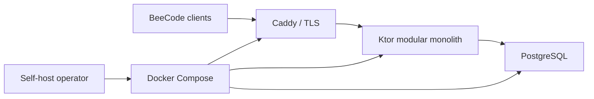

# Target 08: private Leaderboards

This target is BeeCode's entire first social feature: simple custom
Leaderboards resembling private Anki Leaderboard groups. A user creates a named
board, shares a high-entropy invite, and compares successful Problem-review
activity with friends.

## Product boundary

Included:

- private invite-only boards;
- membership in several boards;
- owner invite rotation and member removal;
- member leave;
- Today, This week, and All time periods;
- rank, avatar, display name, equipped confirmed title, Problems solved, and
  current streak;
- eventual offline synchronization;
- self-hosting on one small server.

Excluded from v1:

- public discovery or global rankings;
- chat, comments, reactions, follows, direct messages, or feeds;
- seasons, leagues, prizes, or custom scoring scripts;
- real-time WebSockets;
- remote Python execution;
- cross-device sync of source, review history, or FSRS state.

## Planned server topology



No Redis, broker, object store, Kubernetes, or microservices are needed until
measured load proves otherwise.

## Ranking semantics

- One accepted `ProblemSolved` event per finalized `reviewSessionId` counts as
  one Problem completion.
- Retrying tests in the same session never adds another completion.
- Reviewing the same Problem in a later legitimate session can count again.
- Only Problem revisions/hashes from a server-trusted manifest count socially.
- Today/week boundaries use the Leaderboard's configured IANA timezone.
- Week start is fixed at board creation or changed prospectively by explicit
  owner action.
- Current streak means consecutive board-local dates containing at least one
  accepted completion.
- Rank sorts count descending. Equal counts receive equal dense rank; display
  ordering then uses a documented deterministic tie-breaker.
- “Problems solved” is activity, not mastery, and the UI says so.

## Minimal API plan

```text
POST   /v1/auth/register
POST   /v1/auth/login
POST   /v1/auth/refresh
POST   /v1/auth/logout
GET    /v1/me
PATCH  /v1/me

POST   /v1/activity-events/batch

GET    /v1/leaderboards
POST   /v1/leaderboards
GET    /v1/leaderboards/{id}?period=today|week|all
POST   /v1/leaderboards/join
POST   /v1/leaderboards/{id}/invites/rotate
DELETE /v1/leaderboards/{id}/members/{accountId}
POST   /v1/leaderboards/{id}/leave

GET    /v1/me/achievements
PUT    /v1/me/equipped-title/{achievementId}
GET    /v1/server-capabilities
```

Endpoints beyond this list require a recorded user need.

## Server-visible activity fields

Allowed:

- event/schema version;
- account/device IDs;
- client event ID and review session ID;
- Problem ID, revision, content hash, and suite hash;
- completion instant and claimed timezone/local date;
- trusted-manifest eligibility/acceptance state;
- received-at instant.

Forbidden:

- Python source or source hash usable for code reconstruction;
- stdout/stderr;
- expected/actual test values or failure details;
- full attempt transcript;
- FSRS stability, difficulty, interval, due date, rating, or parameters;
- local database or backup content.

## LDB-001 — Create a self-hostable modular monolith

- **State:** proposed
- **Outcome:** a technically capable user can run the service without operating
  distributed infrastructure.
- **Deliverables:** Ktor service, PostgreSQL schema/migrations, Docker Compose,
  Caddy example, health/readiness, configuration validation, and non-root image.
- **Acceptance:**
  - Fresh deployment starts from empty storage with one documented command.
  - Restart preserves data and schema migration locks prevent races.
  - Unsafe default production secrets/public URLs fail startup.
  - Health and readiness distinguish process from database/migration status.
  - Resource limits and persistent volumes are documented.
- **Evidence:** independent clean-host deployment and restart test.
- **Dependencies:** ARCH-007, OPS-004.
- **Risks:** self-host documentation assuming hidden expertise.
- **Non-goals:** public SaaS operations in v1.

## LDB-002 — Implement local-friendly authentication

- **State:** proposed
- **Outcome:** self-hosted accounts are secure without forcing an email
  provider.
- **Deliverables:** registration mode, login, Argon2id password storage,
  short-lived access tokens, hashed rotating device refresh tokens, logout,
  recovery codes, and admin recovery CLI.
- **Acceptance:**
  - Passwords are never stored/logged plaintext.
  - Refresh token replay revokes or isolates the affected token family.
  - Tokens validate issuer/audience/expiry and are device-scoped.
  - Open, invite-only, and closed registration modes are explicit.
  - Recovery does not require email in the initial self-hosted design.
- **Evidence:** attack-case integration suite.
- **Dependencies:** SEC-005.
- **Risks:** inventing authentication details incorrectly.
- **Non-goals:** social login or enterprise SSO in v1.

## LDB-003 — Implement private board membership

- **State:** proposed
- **Outcome:** users can create, join, list, leave, and moderate private custom
  Leaderboards.
- **Deliverables:** board entity, owner/member roles, invite entity, opaque
  token/hash, expiry, rotate/revoke, removal, leave, owner succession/deletion
  policy, and authorization matrix.
- **Acceptance:**
  - Boards are undiscoverable without membership/invite.
  - Invite rotation invalidates old codes.
  - Only owner can remove another member or rotate invite.
  - Removed/left members lose ranking access promptly.
  - Every board has a valid owner or follows explicit deletion/succession.
- **Evidence:** authorization/state-machine tests.
- **Dependencies:** LDB-002.
- **Risks:** leaked invite links; orphaned boards.
- **Non-goals:** moderators/complex role systems in v1.

## LDB-004 — Ingest activity idempotently

- **State:** proposed
- **Outcome:** offline/retried batches produce exactly one social effect per
  canonical completion.
- **Deliverables:** versioned batch request, item-level result, uniqueness
  constraints, partial acceptance, retry codes, validation, and quotas.
- **Acceptance:**
  - Unique `(accountId, clientEventId)` and
    `(accountId, reviewSessionId, eventType)` prevent duplication.
  - Batch response separates accepted, duplicate, retryable, and final rejected
    IDs.
  - One bad item does not ambiguously fail accepted peers.
  - Reordered batches yield identical totals.
  - Payload/request sizes are bounded.
- **Evidence:** duplicate, reordered, timeout-after-commit, and partial batch
  tests.
- **Dependencies:** DATA-004, ACH-003.
- **Risks:** treating HTTP exactly-once delivery as possible.
- **Non-goals:** synchronous review finalization waiting on upload.

## LDB-005 — Enforce trusted Problem manifests

- **State:** proposed
- **Outcome:** social counts refer to recognized official/approved content
  revisions without uploading solutions.
- **Deliverables:** manifest table/import, Problem/revision/content/suite hashes,
  active window, compatibility, and operator update command.
- **Acceptance:**
  - Unknown or mismatched Problem revisions do not count.
  - Old accepted revisions have a deliberate sunset/grandfather policy.
  - Manifest updates are auditable and rollback-aware.
  - Clients can inspect rejection as content incompatibility.
- **Evidence:** manifest acceptance/rejection matrix.
- **Dependencies:** PROB-008, LDB-004.
- **Risks:** self-hosters forgetting manifest updates.
- **Non-goals:** cryptographic proof that the learner personally wrote code.

## LDB-006 — Calculate Today, week, all-time, and streaks

- **State:** proposed
- **Outcome:** ranking periods and ties are stable across timezones and retries.
- **Deliverables:** board timezone/week-start, period query, dense-rank rule,
  deterministic display order, streak reducer, indexes, and cache policy.
- **Acceptance:**
  - Midnight, week rollover, DST gap/overlap, leap day, and year boundary
    fixtures pass.
  - Changing board timezone/week start is prospective and auditable.
  - Equal counts receive documented equal rank.
  - Query meets expected small-community performance without preoptimization.
  - A fresh aggregation matches any materialized summary.
- **Evidence:** real PostgreSQL integration and benchmark suite.
- **Dependencies:** LDB-004.
- **Risks:** client/server period disagreement.
- **Non-goals:** custom scoring formulas.

## LDB-007 — Build the durable client outbox

- **State:** proposed
- **Outcome:** studying offline for days/weeks safely synchronizes later.
- **Deliverables:** pending/in-flight/acknowledged/retryable/final-rejected
  states, batching, exponential backoff with jitter, token refresh, retention,
  manual retry, and visible status.
- **Acceptance:**
  - Review finalization never waits for network.
  - App restart preserves pending events.
  - Timeout after server commit safely retries as duplicate.
  - Rejection cannot undo local review, FSRS, or local achievement.
  - Acknowledged rows prune only under documented retention.
- **Evidence:** airplane mode, outage, token expiry, process kill, and retry
  integration tests.
- **Dependencies:** DATA-002, LDB-004.
- **Risks:** infinite retry/battery use; silent permanent rejection.
- **Non-goals:** synchronizing source or schedule state.

## LDB-008 — Define minimal social profiles

- **State:** proposed
- **Outcome:** board rows are recognizable without exposing unnecessary
  personal data.
- **Deliverables:** display name, optional avatar reference/upload decision,
  equipped confirmed title, membership, visibility, and moderation constraints.
- **Acceptance:**
  - Nonmembers cannot enumerate profiles/boards.
  - An equipped title references a confirmed award.
  - Display names have length/Unicode/safety policy.
  - Avatar storage is omitted until an actual storage/abuse need is solved; an
    initial generated/local avatar is acceptable.
  - Account deletion/anonymization behavior is documented.
- **Evidence:** authorization/privacy tests.
- **Dependencies:** ACH-007, SEC-006.
- **Risks:** image hosting and moderation expanding scope.
- **Non-goals:** bios, follows, public profiles, or presence.

## LDB-009 — Build the simple Leaderboard client

- **State:** proposed
- **Outcome:** users can create/join boards and understand ranks/sync without a
  complex social UI.
- **Deliverables:** board list, create/join, invite share/rotate, member
  management, Today/week/all tabs, ranking rows, stale/offline state, and leave.
- **Acceptance:**
  - Row shows rank, avatar, name/title, Problems solved, and current streak.
  - Pending local activity is not shown as server-confirmed rank.
  - Offline uses last snapshot with freshness label.
  - Owner-only actions are hidden and domain/API-authorized.
  - Empty/error/removed-member states are clear.
- **Evidence:** UI contract and end-to-end two-account journey.
- **Dependencies:** LDB-003, LDB-006, LDB-007, LDB-008.
- **Risks:** implying real-time consistency.
- **Non-goals:** activity feed or messaging.

## LDB-010 — Add friendly anti-abuse controls

- **State:** proposed
- **Outcome:** obvious replay/flood/time/content abuse is bounded without
  invasive surveillance.
- **Deliverables:** authentication, idempotency, trusted manifest, timestamp
  sanity, per-account/device quotas, request limits, audit events, and owner
  removal.
- **Acceptance:**
  - Far-future timestamps cannot distort current periods.
  - Excessive event rates are rejected/rate-limited with stable codes.
  - Audit logs contain IDs/actions but not source or secrets.
  - Operators can remove abusive members without database surgery.
  - Local honest study remains intact after server rejection.
- **Evidence:** abuse fixtures and load/rate tests.
- **Dependencies:** LDB-004, LDB-005, SEC-008.
- **Risks:** anti-cheat becoming surveillance or blocking offline users.
- **Non-goals:** prize-grade cheat detection.

## LDB-011 — Version server capabilities and compatibility

- **State:** proposed
- **Outcome:** independently upgraded self-hosted clients and servers fail
  predictably.
- **Deliverables:** versioned HTTP/OpenAPI contract, capabilities endpoint,
  event-version negotiation, compatibility window, structured errors, and
  deprecation policy.
- **Acceptance:**
  - Supported older client can upload/read current server.
  - Unsupported version receives actionable upgrade response without data loss.
  - Unknown fields and enum values follow written policy.
  - Database entities do not leak as API DTOs.
- **Evidence:** contract tests against multiple frozen client fixtures.
- **Dependencies:** ARCH-006.
- **Risks:** server upgrades stranding offline outbox events.
- **Non-goals:** perpetual compatibility.

## LDB-012 — Make operations boring

- **State:** proposed
- **Outcome:** self-hosters can deploy, upgrade, back up, restore, observe, and
  recover the service.
- **Deliverables:** operator guide, configuration reference, TLS example,
  migrations, `pg_dump` backup/restore, logs/metrics, admin CLI, upgrade/rollback
  notes, and incident checklist.
- **Acceptance:**
  - Independent operator deploys from documentation.
  - Timed backup restoration into clean environment passes.
  - Token secret rotation and account recovery are rehearsed.
  - Logs exclude passwords, bearer/refresh tokens, raw invites, source, test
    output, and FSRS state.
  - Failure modes include database unavailable/full/corrupt and migration error.
- **Evidence:** deployment, restore, and incident tabletop reports.
- **Dependencies:** OPS-004, OPS-005, SEC-010.
- **Risks:** “simple server” still requiring real data operations.
- **Non-goals:** managed high-availability clustering.

## Suggested server data constraints

| Entity | Critical constraint |
|---|---|
| Account | Unique normalized login identity; password hash only. |
| Device/refresh token | Token hash, rotation family, expiry/revocation. |
| Leaderboard | One owner; named timezone and week start. |
| Membership | Unique `(leaderboardId, accountId)`. |
| Invite | Hashed token, expiry, revocation/version. |
| Activity | Unique client event and review-session keys per account. |
| Award | Unique achievement semantic award key per account. |
| Equipped title | Must reference confirmed award. |

## Leaderboard exit gate

Two clients must be able to join a private board, study offline, upload later,
and observe stable Today/week/all-time ranks with duplicates ignored. Captured
requests, database rows, and logs must prove that source, test output, and FSRS
state never crossed the server boundary. A clean self-host deployment and
restore must also succeed.

