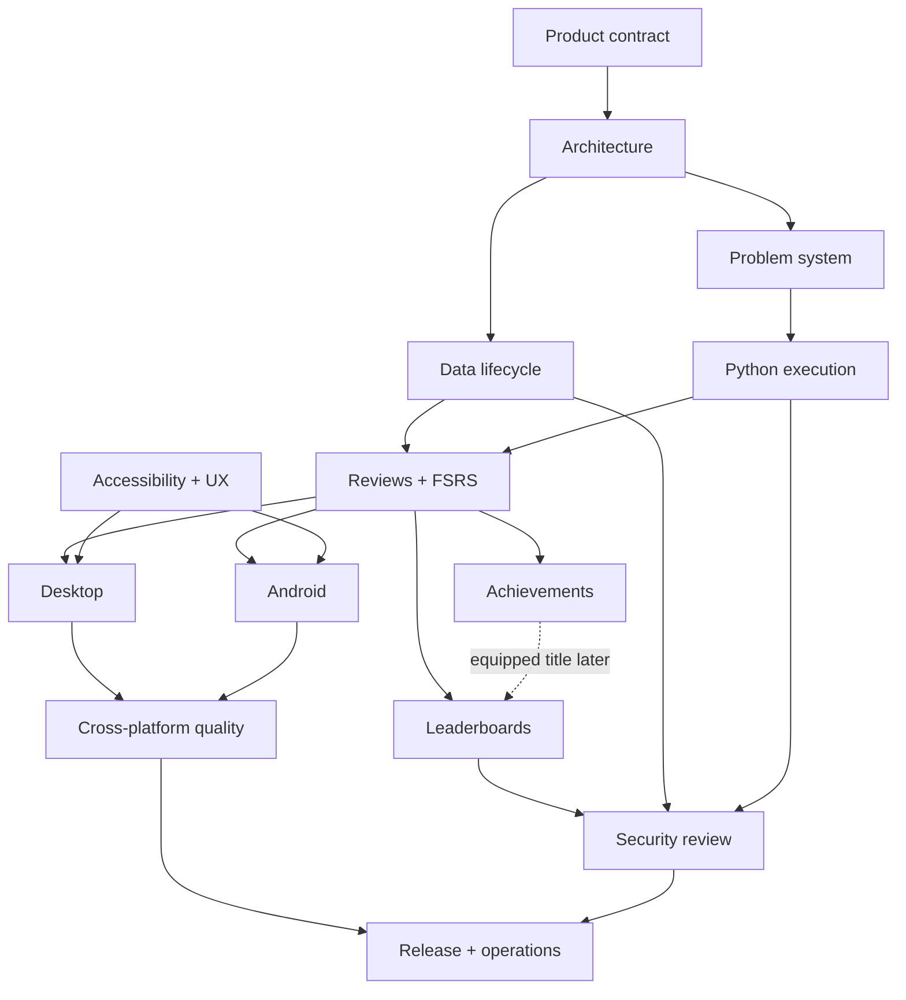

# BeeCode: year-scale goals

This directory is the executable product plan for BeeCode: an offline-first
Android and desktop application that turns algorithmic coding Problems into
spaced-repetition reviews, runs Python solutions locally, awards meaningful
achievements, and optionally compares activity inside private Leaderboards.

The plan is deliberately deeper than an MVP backlog. It describes the smallest
useful release, the architecture that can survive a long-lived product, and the
evidence required before each target can be called complete. The 164 goals are
a north-star programme, not a one-year promise; completing all of them is
expected to take roughly 18–30 months for one primary developer.

Use [YEAR-ONE.md](YEAR-ONE.md) for the committed/conditional delivery cut,
calendar, feasibility gates, reserve, and slip rules for the first 52 weeks.

## North-star outcome

A learner opens BeeCode, sees the Problems due today, writes a Python solution,
runs deterministic tests without leaving the app, and finalizes the review.
BeeCode records the attempt, schedules the next review with the user's FSRS
engine, updates local achievements, and—only if the learner opted in—uploads a
small account-global idempotent activity receipt to the optional Leaderboard
service. Current private-board memberships project that activity using their
written membership-episode rules.

Problem/review semantics should feel coherent on Android and desktop even
though code execution is implemented differently on each platform. v1 uses
independent local profiles plus deliberate backup transfer; it does not promise
live cross-device study-history synchronization.

## Product rules that do not drift

1. The app is **BeeCode**. A study item is always a **Problem**.
2. Studying, running code, scheduling reviews, and earning local achievements
   work without an account or network.
3. A Problem is repository-native content, not a row hand-authored in a central
   registry.
4. Scheduling uses the user's FSRS 7 implementation from
   `bee-san/kanji_anki`, pinned and tested independently from BeeCode policy.
5. Learner source code, test output, and FSRS memory state stay local.
6. A passing test run is evidence, not automatically a finalized review.
7. Every finalized review is idempotent and traceable to one review session.
8. The server is optional and deliberately boring: a small API, PostgreSQL, and
   straightforward self-hosting.
9. “5am Club” means a qualifying successful Problem review before 06:00 on
   seven consecutive local calendar days; the boundary is exact and tested.
10. Desktop and Android share domain behavior but do not pretend their Python
    execution boundaries are identical.
11. No goal is complete because a screen exists. It is complete when its
    acceptance criteria and evidence are satisfied.

## How to read the plan

Each target document contains stable goal identifiers. Identifiers are never
reused even if a goal is retired.

| State | Meaning |
|---|---|
| `proposed` | Worth doing, but sequencing or design may still change. |
| `ready` | Dependencies and acceptance criteria are clear enough to start. |
| `active` | Implementation work is in progress. |
| `blocked` | A named dependency or decision prevents useful progress. |
| `verified` | All acceptance criteria have linked evidence. |
| `operational` | Initial acceptance passed; a recurring control has an owner and next review date. |
| `retired` | Deliberately removed or superseded; rationale is retained. |

Each goal uses this contract:

| Field | Purpose |
|---|---|
| Outcome | User or system behavior that should become true. |
| Deliverables | Concrete artifacts expected from the work. |
| Acceptance | Observable, binary completion criteria. |
| Evidence | Tests, reports, measurements, demos, or review records. |
| Dependencies | Goals that must be complete or decisions that must be made. |
| Risks | Likely failure modes and planned mitigations. |
| Non-goals | Scope intentionally excluded from this goal. |

## Target map

| Target | Goal prefix | Document | Principal result |
|---|---:|---|---|
| Product contract | `PROD` | [00](00-product-charter.md) | A stable definition of BeeCode and its first users. |
| Architecture | `ARCH` | [01](01-architecture-foundations.md) | Replaceable platform edges around a shared domain. |
| Problem system | `PROB` | [02](02-problem-system.md) | Add one folder, validate it, and ship it safely. |
| Python execution | `RUN` | [03](03-python-execution.md) | Deterministic local runs with explicit resource limits. |
| Reviews and FSRS | `SRS` | [04](04-reviews-and-fsrs.md) | Correct, auditable scheduling from finalized reviews. |
| Desktop | `DSK` | [05](05-desktop-client.md) | A productive keyboard-first BeeCode experience. |
| Android | `AND` | [06](06-android-client.md) | A resilient phone-first solving and review flow. |
| Achievements | `ACH` | [07](07-achievements.md) | Local, deterministic, extensible accomplishments. |
| Leaderboards | `LDB` | [08](08-leaderboards.md) | Simple private social comparison on a self-hosted server. |
| Data lifecycle | `DATA` | [09](09-data-lifecycle.md) | Durable local data, migrations, import/export, recovery. |
| Security and privacy | `SEC` | [10](10-security-and-privacy.md) | A threat model and tested trust boundaries. |
| Quality | `QLT` | [11](11-quality-and-testing.md) | Confidence across domain, content, runtimes, and UI. |
| Delivery and operations | `OPS` | [12](12-delivery-and-operations.md) | Reproducible releases and maintainable self-hosting. |
| Accessibility and UX | `UX` | [13](13-accessibility-and-ux.md) | Fast, legible, inclusive daily use. |

## Dependency model

This is a dependency graph, not a mandate to finish whole layers in sequence.
Development should use thin vertical slices: one bundled Problem, one local
run, one finalized review, one FSRS transition, and one visible next-due date
before broadening any layer.

## Hands-on test milestones

These are the first two milestones at which the owner should install BeeCode
and test it as a product. M0–M2 remain necessary engineering gates, but they do
not count as the requested hands-on milestones.

### Test 1 — Answer a Problem on both clients

**Target:** M3 exit, end of week 27.

Install a desktop tester package and Android tester APK, then perform the same
accountless, offline journey on each:

1. open a bundled Problem and read its prompt/examples;
2. edit the Python starter into an answer;
3. run the official tests and inspect a deliberate failure;
4. correct the answer, rerun, and pass;
5. finalize the review and see its next due date;
6. close/relaunch and confirm source, history, and schedule survived.

This milestone does not wait for achievements, Leaderboards, analytics, broad
content, visual polish, or release packaging. Android evidence includes an
emulator/reachable device and physical phone; a desktop-only demo does not pass.

### Test 2 — Test the social loop

**Target:** M4 exit, end of week 34, conditional on Test 1 passing.

Run the documented self-host stack and use a friend or second test account to:

1. register two accounts;
2. create a private Leaderboard and join through an invitation;
3. complete a Problem and see the Problems count/streak appear;
4. complete once while offline, reconnect, and see one social effect;
5. retry/refresh without creating duplicate credit;
6. leave/rejoin and observe the documented membership-episode behavior.

Captured requests, rows, and logs must demonstrate that source, test output,
and FSRS state were not uploaded. Achievement titles, including 5am Club, are
added after this checkpoint and are not allowed to block the basic social test.

## Year-one delivery cut

The first year aims for a strong private beta, with stable 1.0 conditional on
the written release gates. It reserves weeks 45–52 instead of prescheduling
them and makes the private Leaderboard conditional on Android local alpha
passing by week 27.

| Period | Milestone | Exit result |
|---|---|---|
| Weeks 1–4 | M0: feasibility and contracts | Android Python, desktop worker, editor/IME, persistence, FSRS provenance, device access, rights, and threat-boundary decisions. |
| Weeks 5–11 | M1: thin desktop slice | One-folder Problem authoring and a durable bounded local Python run. |
| Weeks 12–18 | M2: review truth | Atomic selected-run finalization, FSRS 7 scheduling, due queue, replay, and restore baseline. |
| Weeks 19–27 | **M3 / Test 1: playable desktop + Android alpha** | Owner installs both clients and completes the answer–run–retry–finalize–restart journey. |
| Weeks 28–34 | **M4 / Test 2: social alpha** | Owner tests a private Leaderboard with two accounts, offline upload, stable counts, and no source transfer. |
| Weeks 35–38 | M5: achievements/content | Exact 5am Club, restrained initial achievements, reviewed seed pack, and optional social titles. |
| Weeks 39–44 | M6: feature freeze/private beta | Migration, recovery, security, accessibility, performance, documentation, and beta fixes. |
| Weeks 45–52 | M7: contingency/release reserve | Stable release only if all gates pass; otherwise an honest private beta and reforecast. |

The detailed calendar, commitment classes, per-milestone gates, fallback ladder,
and stop/slip rules are in [YEAR-ONE.md](YEAR-ONE.md).

## Vertical proof slices

The milestone plan is complemented by small demonstrable proofs. These are
evidence slices inside the numbered milestones, not a second milestone
taxonomy. Each proof must exercise real behavior across boundaries; it is not a
collection of screenshots.

| Proof slice | Demonstration |
|---|---|
| Shell proof | Desktop and Android launch from one documented checkout. |
| First-run proof | Two Sum loads from a pack and executes locally on desktop. |
| First-review proof | A passing solution becomes one finalized review and due date. |
| Daily-driver proof | Due queue, drafts, history, settings, backup, and recovery work. |
| **Hands-on Test 1** | Owner completes one full Problem journey on installed desktop and Android builds. |
| **Hands-on Test 2** | Owner tests a private Leaderboard with a friend or second account. |
| Motivation proof | Events rebuild progress, unlock 5am Club, and add its optional social title correctly. |
| Release proof | Signed clients and a documented server survive migration rehearsal. |

## Cross-cutting definition of done

Every implementation goal eventually inherits these requirements unless its
document explicitly says otherwise:

- Naming uses BeeCode, Problem, Review, and Leaderboard consistently.
- Domain rules have deterministic automated tests.
- Errors identify what happened and what the learner can do next.
- Local behavior works with the network unavailable.
- Sensitive fields have a stated storage, logging, and transfer policy.
- Any persisted or public format has a version and migration strategy.
- Any background or retried operation is idempotent.
- Accessibility semantics and keyboard navigation are considered.
- Desktop and Android parity is specified at the behavior level.
- Metrics have a purpose, privacy classification, and retention rule.
- Documentation contains fresh-install and recovery paths.
- A goal owner can point to evidence, not merely a merged change.

## Decision checkpoints

These choices should be made early, but only after a small spike validates the
hardest assumption:

1. **Shared UI versus shared domain only.** Start from Compose Multiplatform,
   but preserve platform runtime boundaries and measure editor quality before
   committing every screen to shared UI.
2. **Android Python embedding.** Validate runtime size, startup, supported
   modules, subprocess behavior, and long-term maintenance before locking the
   provider.
3. **Persistence implementation.** Choose a migration-capable multiplatform
   database after testing desktop packaging and Android process restoration.
4. **Problem authoring syntax.** Prefer readable source files but generate one
   strict canonical runtime representation.
5. **Editor component.** Begin with a controlled plain editor; adopt a richer
   engine only after keyboard, IME, accessibility, and large-file evidence.
6. **Cross-device study sync.** It is explicitly outside v1. If later accepted,
   it becomes a separate encrypted system rather than an extension of social
   activity upload.

## Scope control

Tempting ideas intentionally excluded from v1:

- executing arbitrary third-party packages from the internet;
- multiple programming languages;
- public global rankings;
- chat, comments, direct messages, follows, or activity feeds;
- real-time sockets for ranking updates;
- cross-device merge of drafts, review history, or FSRS state;
- collaborative editing;
- AI-generated solutions or hints as a core dependency;
- importing LeetCode proprietary statement text without permission;
- cash prizes or high-stakes anti-cheat;
- plugin APIs before the Problem pack contract is stable.

These are not rejected forever. They are prevented from silently expanding the
critical path.

## Planning maintenance cadence

- **Weekly:** update active goal status, blockers, and evidence links.
- **Fortnightly:** demo one vertical behavior and delete obsolete backlog work.
- **Monthly:** review risk register, dependency graph, performance budgets, and
  security assumptions.
- **At every milestone:** run the gate, record deviations, and reforecast dates.
- **Quarterly:** revisit product outcomes with actual study behavior; do not
  optimize engagement proxies that weaken learning.

The plan is a control surface, not a monument. Details may change; the product
rules and evidence standard should change only through an explicit decision.
