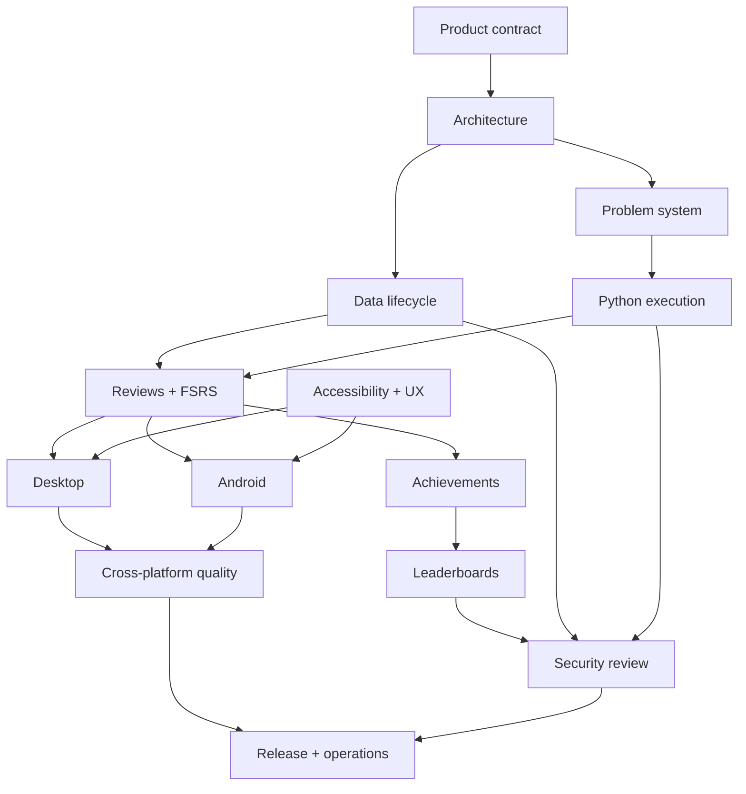

# BeeCode: year-scale goals

This directory is the executable product plan for BeeCode: an offline-first
Android and desktop application that turns algorithmic coding Problems into
spaced-repetition reviews, runs Python solutions locally, awards meaningful
achievements, and optionally compares activity inside private Leaderboards.

The plan is deliberately deeper than an MVP backlog. It describes the smallest
useful release, the architecture that can survive a year of development, and
the evidence required before each target can be called complete.

## North-star outcome

A learner opens BeeCode, sees the Problems due today, writes a Python solution,
runs deterministic tests without leaving the app, and finalizes the review.
BeeCode records the attempt, schedules the next review with the user's FSRS
engine, updates local achievements, and—only if the learner opted in—uploads a
small idempotent activity receipt to one or more private Leaderboards.

The same study history and Problem semantics should feel coherent on Android
and desktop even though code execution is implemented differently on each
platform.

## Product rules that do not drift

1. The app is **BeeCode**. A study item is always a **Problem**.
2. Studying, running code, scheduling reviews, and earning local achievements
   work without an account or network.
3. A Problem is repository-native content, not a row hand-authored in a central
   registry.
4. Learner source code, test output, and FSRS memory state stay local.
5. A passing test run is evidence, not automatically a finalized review.
6. Every finalized review is idempotent and traceable to one review session.
7. The server is optional and deliberately boring: a small API, PostgreSQL, and
   straightforward self-hosting.
8. “5am Club” means a qualifying successful Problem review before 06:00 on
   seven consecutive local calendar days; the boundary is exact and tested.
9. Desktop and Android share domain behavior but do not pretend their Python
   sandboxes are identical.
10. No goal is complete because a screen exists. It is complete when its
    acceptance criteria and evidence are satisfied.

## How to read the plan

Each target document contains stable goal identifiers. Identifiers are never
reused even if a goal is retired.

| State | Meaning |
|---|---|
| `proposed` | Worth doing, but sequencing or design may still change. |
| `ready` | Dependencies and acceptance criteria are clear enough to start. |
| `active` | Implementation work is in progress. |
| `blocked` | A named dependency or decision prevents useful progress. |
| `verified` | All acceptance criteria have linked evidence. |
| `retired` | Deliberately removed or superseded; rationale is retained. |

Each goal uses this contract:

| Field | Purpose |
|---|---|
| Outcome | User or system behavior that should become true. |
| Deliverables | Concrete artifacts expected from the work. |
| Acceptance | Observable, binary completion criteria. |
| Evidence | Tests, reports, measurements, demos, or review records. |
| Dependencies | Goals that must be complete or decisions that must be made. |
| Risks | Likely failure modes and planned mitigations. |
| Non-goals | Scope intentionally excluded from this goal. |

## Target map

| Target | Goal prefix | Document | Principal result |
|---|---:|---|---|
| Product contract | `PROD` | [00](00-product-charter.md) | A stable definition of BeeCode and its first users. |
| Architecture | `ARCH` | [01](01-architecture-foundations.md) | Replaceable platform edges around a shared domain. |
| Problem system | `PROB` | [02](02-problem-system.md) | Add one folder, validate it, and ship it safely. |
| Python execution | `RUN` | [03](03-python-execution.md) | Deterministic local runs with explicit resource limits. |
| Reviews and FSRS | `SRS` | [04](04-reviews-and-fsrs.md) | Correct, auditable scheduling from finalized reviews. |
| Desktop | `DSK` | [05](05-desktop-client.md) | A productive keyboard-first BeeCode experience. |
| Android | `AND` | [06](06-android-client.md) | A resilient phone-first solving and review flow. |
| Achievements | `ACH` | [07](07-achievements.md) | Local, deterministic, extensible accomplishments. |
| Leaderboards | `LDB` | [08](08-leaderboards.md) | Simple private social comparison on a self-hosted server. |
| Data lifecycle | `DATA` | [09](09-data-lifecycle.md) | Durable local data, migrations, import/export, recovery. |
| Security and privacy | `SEC` | [10](10-security-and-privacy.md) | A threat model and tested trust boundaries. |
| Quality | `QLT` | [11](11-quality-and-testing.md) | Confidence across domain, content, runtimes, and UI. |
| Delivery and operations | `OPS` | [12](12-delivery-and-operations.md) | Reproducible releases and maintainable self-hosting. |
| Accessibility and UX | `UX` | [13](13-accessibility-and-ux.md) | Fast, legible, inclusive daily use. |

## Dependency model

This is a dependency graph, not a mandate to finish whole layers in sequence.
Development should use thin vertical slices: one bundled Problem, one local
run, one finalized review, one FSRS transition, and one visible next-due date
before broadening any layer.

## One-year roadmap

The schedule assumes one primary developer working consistently and allows
research, iteration, and recovery time. It is a planning baseline, not a
promise. Each phase ends with a gate: if the evidence is weak, the next phase
does not paper over it.

### Phase 0 — Decisions and walking skeleton (weeks 1–4)

**Purpose:** remove expensive ambiguity and prove the chosen build can launch.

- Ratify the product vocabulary, supported platforms, minimum Android version,
  and Python language level.
- Record architecture decisions for shared code, persistence, Problem
  packaging, runner contracts, and server boundaries.
- Create a reproducible developer setup and CI smoke build.
- Demonstrate a hard-coded Problem in a desktop and Android shell without
  claiming the content or runner systems are finished.

**Exit gate**

- Product and architecture goals marked ready.
- Clean-machine setup instructions exercised by someone other than the author.
- Both applications can be built from one revision.
- No server is required to launch or study.

### Phase 1 — Problem authoring and desktop execution (weeks 5–12)

**Purpose:** make adding and solving Problems real before building broad UI.

- Finalize Problem source schema, codecs, comparators, revision rules, and
  generated pack format.
- Provide `new`, `validate`, `test`, `build`, and `inspect` authoring commands.
- Ship a small reference pack spanning scalar, collection, linked-list, tree,
  and graph data.
- Implement the desktop Python worker protocol, deterministic test harness,
  cancellation, timeouts, output limits, and failure taxonomy.
- Deliver the first end-to-end desktop solving session.

**Exit gate**

- A contributor adds a valid Problem without editing a central registry.
- Invalid content fails with file, field, and remediation.
- Reference solutions pass in CI; deliberately broken solutions fail for the
  expected reason.
- Hanging and output-flooding programs are terminated and surfaced cleanly.

### Phase 2 — Review truth and FSRS (weeks 13–20)

**Purpose:** make BeeCode trustworthy as a daily study tool.

- Define review-session states and event invariants.
- Integrate the generic FSRS engine from `bee-san/kanji_anki` through a
  BeeCode-owned scheduler boundary.
- Persist review history, memory state, due dates, preferences, and clocks with
  migration coverage.
- Separate “tests passed” from “review finalized”.
- Build due queues, new-Problem limits, lapse handling, and review summaries.

**Exit gate**

- Golden FSRS transition tests match the source engine.
- Replaying or double-tapping finalization cannot duplicate a review.
- Clock, timezone, restart, and migration tests preserve schedule truth.
- A learner can use the desktop app for two weeks without data repair.

### Phase 3 — Android parity and mobile resilience (weeks 21–30)

**Purpose:** make the phone experience genuinely useful, not a shrunken desktop.

- Embed a supported Python runtime behind the shared runner contract.
- Design a touch-first editor, test controls, keyboard behavior, result
  inspection, and review finalization.
- Handle process death, rotation, backgrounding, low storage, and offline use.
- Profile startup, editor latency, test latency, memory, and battery.
- Exercise a device/API matrix including at least one physical device.

**Exit gate**

- The reference Problem pack behaves equivalently on desktop and Android.
- Draft source survives expected Android lifecycle events.
- Resource-limit failures do not crash or freeze the application.
- Accessibility checks and phone usability sessions have no release blockers.

### Phase 4 — Achievements and motivation (weeks 31–36)

**Purpose:** add motivation without corrupting study truth.

- Create append-only domain events and deterministic achievement projections.
- Add achievement definitions, progress, unlocks, title rewards, and replay.
- Implement 5am Club with explicit timezone and consecutive-date semantics.
- Add a small initial set of achievements that rewards consistency and breadth,
  not meaningless volume.

**Exit gate**

- Achievement state can be rebuilt entirely from canonical local events.
- Boundary tests cover 05:59:59, 06:00:00, DST, timezone changes, retries, and
  multiple qualifying reviews on one date.
- Reinstall/import does not spuriously re-award notifications.

### Phase 5 — Private Leaderboards (weeks 37–44)

**Purpose:** add simple opt-in social accountability without turning BeeCode
into a social network.

- Implement accounts, private Leaderboard creation/joining, invite rotation,
  membership removal, activity upload, and period rankings.
- Deploy a single self-hostable API and PostgreSQL stack.
- Implement an offline outbox and idempotent batch upload.
- Show Today, This week, and All time ranks with Problems solved and streak.
- Document backup, upgrade, reverse-proxy, and abuse-response operations.

**Exit gate**

- A new operator can deploy from documentation on a small server.
- Duplicate, delayed, and out-of-order uploads do not change totals.
- No request or database column contains solution source, test output, or FSRS
  state.
- Revoked refresh tokens and rotated invites behave as documented.

### Phase 6 — Hardening, beta, and release (weeks 45–52)

**Purpose:** turn a working system into one that can be trusted and maintained.

- Run threat modeling and targeted security review of both runners and server.
- Fuzz Problem decoders, worker protocol, API inputs, and import files.
- Complete backup/restore and migration rehearsals.
- Establish crash reporting that is opt-in and redacts learner content.
- Run a staged beta, triage usability evidence, and publish signed releases.
- Freeze v1 scope and move deferred ideas into explicit post-v1 goals.

**Exit gate**

- No critical security, data-loss, or accessibility defect remains open.
- Desktop and Android release artifacts are reproducible from a signed tag.
- Server backup can be restored into a clean environment.
- Release notes, privacy statement, operator guide, and support boundaries are
  complete.

## Milestone slices

The phase plan is complemented by small demonstrable milestones. A milestone
must exercise real behavior across boundaries; it is not a collection of
screenshots.

| Milestone | Demonstration |
|---|---|
| M0: Shells | Desktop and Android launch from one documented checkout. |
| M1: First run | Two Sum loads from a pack and executes locally on desktop. |
| M2: First review | A passing solution becomes one finalized review and due date. |
| M3: Daily driver | Due queue, drafts, history, settings, backup, and recovery work. |
| M4: Mobile solve | The same Problem and tests execute safely on Android. |
| M5: Motivation | Events rebuild progress and can unlock 5am Club correctly. |
| M6: Friends | Two accounts join a private Leaderboard and see stable ranks. |
| M7: Beta | Signed clients and a documented server survive migration rehearsal. |

## Cross-cutting definition of done

Every implementation goal eventually inherits these requirements unless its
document explicitly says otherwise:

- Naming uses BeeCode, Problem, Review, and Leaderboard consistently.
- Domain rules have deterministic automated tests.
- Errors identify what happened and what the learner can do next.
- Local behavior works with the network unavailable.
- Sensitive fields have a stated storage, logging, and transfer policy.
- Any persisted or public format has a version and migration strategy.
- Any background or retried operation is idempotent.
- Accessibility semantics and keyboard navigation are considered.
- Desktop and Android parity is specified at the behavior level.
- Metrics have a purpose, privacy classification, and retention rule.
- Documentation contains fresh-install and recovery paths.
- A goal owner can point to evidence, not merely a merged change.

## Decision checkpoints

These choices should be made early, but only after a small spike validates the
hardest assumption:

1. **Shared UI versus shared domain only.** Start from Compose Multiplatform,
   but preserve platform runtime boundaries and measure editor quality before
   committing every screen to shared UI.
2. **Android Python embedding.** Validate runtime size, startup, supported
   modules, subprocess behavior, and long-term maintenance before locking the
   provider.
3. **Persistence implementation.** Choose a migration-capable multiplatform
   database after testing desktop packaging and Android process restoration.
4. **Problem authoring syntax.** Prefer readable source files but generate one
   strict canonical runtime representation.
5. **Editor component.** Begin with a controlled plain editor; adopt a richer
   engine only after keyboard, IME, accessibility, and large-file evidence.
6. **Cross-device study sync.** It is explicitly outside v1. If later accepted,
   it becomes a separate encrypted system rather than an extension of social
   activity upload.

## Scope control

Tempting ideas intentionally excluded from v1:

- executing arbitrary third-party packages from the internet;
- multiple programming languages;
- public global rankings;
- chat, comments, direct messages, follows, or activity feeds;
- real-time sockets for ranking updates;
- cross-device merge of drafts, review history, or FSRS state;
- collaborative editing;
- AI-generated solutions or hints as a core dependency;
- importing LeetCode proprietary statement text without permission;
- cash prizes or high-stakes anti-cheat;
- plugin APIs before the Problem pack contract is stable.

These are not rejected forever. They are prevented from silently expanding the
critical path.

## Planning maintenance cadence

- **Weekly:** update active goal status, blockers, and evidence links.
- **Fortnightly:** demo one vertical behavior and delete obsolete backlog work.
- **Monthly:** review risk register, dependency graph, performance budgets, and
  security assumptions.
- **At every milestone:** run the gate, record deviations, and reforecast dates.
- **Quarterly:** revisit product outcomes with actual study behavior; do not
  optimize engagement proxies that weaken learning.

The plan is a control surface, not a monument. Details may change; the product
rules and evidence standard should change only through an explicit decision.

